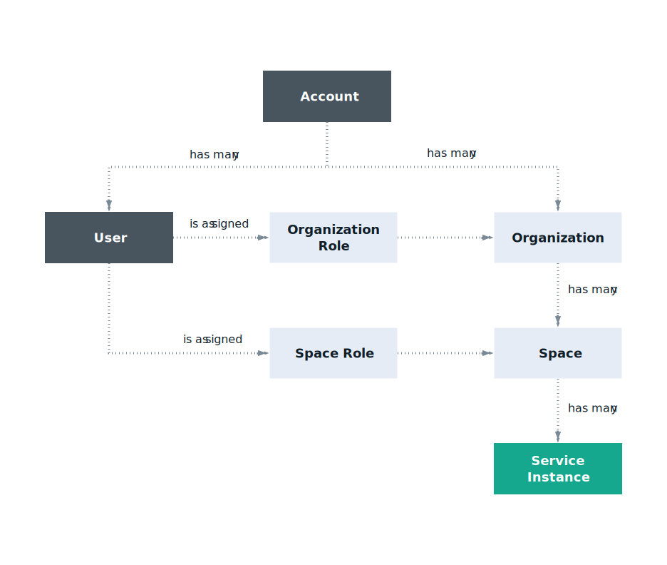

---

copyright:

  years: 2017, 2018

lastupdated: "2018-11-12"

---

{:shortdesc: .shortdesc}
{:codeblock: .codeblock}
{:screen: .screen}
{:new_window: target="_blank"}
{:tip: .tip}
{:note: .note}

# Cloud Foundry access
{: #cfaccess}

Currently, not all services can be managed by using Cloud IAM. You can continue to use Cloud Foundry roles for access to these service instances. Users are added to the org and space to which the instance belongs with a Cloud Foundry role assigned. 
{:shortdesc}

## Cloud Foundry roles
{: #cfroles}

Cloud Foundry roles grant access to organizations and spaces within the account. Cloud Foundry roles do not enable user permissions for completing actions within the context of a service across the account.

The following roles can be assigned at the organization level:

| Organization role | Permissions |
|-------------------|-------------|
|Manager | Organization managers can create, view, edit, or delete spaces within the organization, view the organization's usage and quota, invite users to the organization, manage who has access to the organization and their roles in the organization, and manage custom domains for the organization. |
|Billing manager | Billing managers can view runtime and service usage information for the organization on the Usage Dashboard page.  |
|Auditor | Organization auditors can view application and service content in the organization. Auditors can also view the users in the organization and their assigned roles, and the quota for the organization. |
{:caption="Table 1. Organization roles and permissions" caption-side="top"}

The following roles can be assigned at the space level:

| Space role | Permissions |
|------------|-------------|
|Manager | Space managers can add existing users and manage roles within the space. The space manager can also view the number of instances, service bindings, and resource use for each application in the space. |
|Developer | Space developers can create, delete, and manage applications and services within the space. Some of the managing tasks include deploying apps, starting or stopping apps, renaming an app, deleting an app, renaming a space, binding or unbinding a service to an application, viewing the number or instances, service bindings, and resource usage for each application in the space. In addition, the space developer can associate an internal or external URL with an application in the space.   |
|Auditor | Space auditors have read-only access to all information about the space, such as information about the number of instances, service bindings, and resource use for each application in the space. |
{:caption="Table 2. Space roles and permissions" caption-side="top"}

Users that are assigned the manager or developer space role can access the VCAP_SERVICES environment variable. However, a user that is assigned the auditor role can't access VCAP_SERVICES.
{: note}
